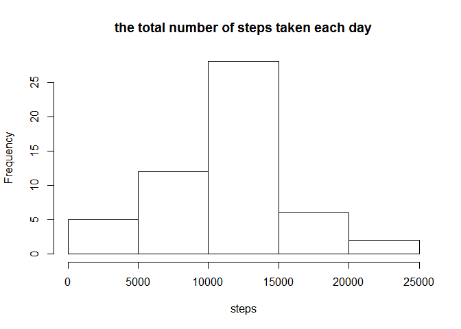
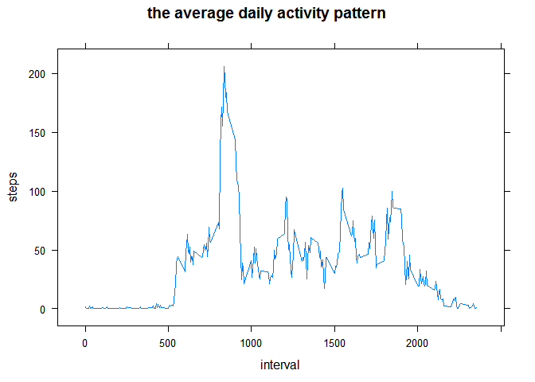
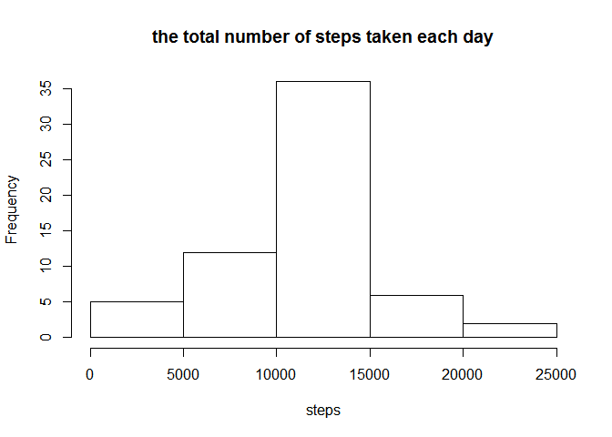
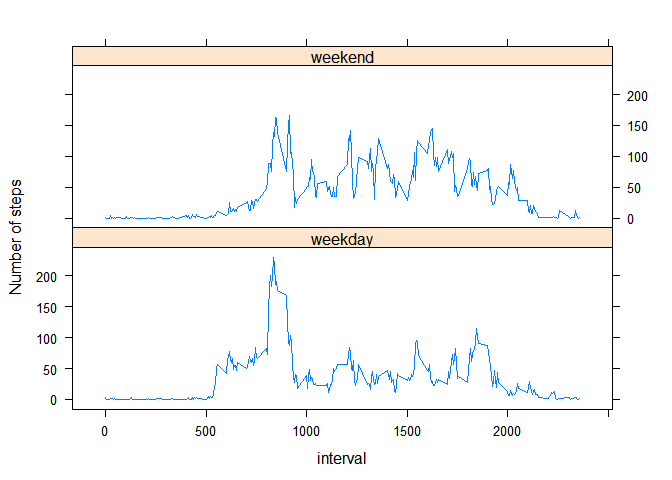

# Reproducible Research: Peer Assessment 1


## Loading and preprocessing the data

```r
activity <- read.csv("activity.csv",sep=",",stringsAsFactors=F)
activity$date <- as.Date(activity$date)
```


## What is mean total number of steps taken per day?


```r
library(dplyr)
```

```
## Warning: package 'dplyr' was built under R version 3.1.2
```

```
## 
## Attaching package: 'dplyr'
## 
## The following object is masked from 'package:stats':
## 
##     filter
## 
## The following objects are masked from 'package:base':
## 
##     intersect, setdiff, setequal, union
```

```r
sum1 <- aggregate(steps~date,data=activity,sum)

hist(sum1$steps,main="the total number of steps taken each day",xlab="steps")
```

 

This is a histogram of the total number of steps taken each day.


```r
mean1 <- mean(sum1$steps)
median1 <- median(sum1$steps)
```
The mean total number of steps taken per day is 1.0766189\times 10^{4}.

The median total number of steps taken per day is 10765.

## What is the average daily activity pattern?

```r
interval <- aggregate(steps~interval,data=activity,sum)
interval_m <- aggregate(steps~interval,data=activity,mean)
library(lattice)
xyplot(steps~interval,data=interval_m,type="l",main="the average daily activity pattern",xlab="interval",ylab="steps")
```

 

```r
max1 <- interval_m$interval[which.max(interval_m$steps)]
```
This is a time series plot of the 5-minute interval and the average number of steps taken, averaged across all days. 
The 835 interval contains the maximum number of steps.

## Imputing missing values


```r
ana <- subset(activity,is.na(steps))
row <- nrow(ana)
```
The total number of missing values in the dataset is 2304.

```r
mer <- merge(activity,interval_m,by="interval")
mer$steps.x[is.na(mer$steps.x)] <- mer$steps.y[is.na(mer$steps.x)]
mer1 <- mer[,-4]
```
The strategy for filling in all of the missing values in the dataset is using the mean for that 5-minute interval.
The new dataset is "mer1".

```r
sum2 <- aggregate(steps.x~date,data=mer1,sum)
hist(sum2$steps.x,main="the total number of steps taken each day",xlab="steps")
```

 

This is a histogram of the total number of steps taken each day.(after NA filled in)

```r
mean2 <- mean(sum2$steps.x)
median2 <- median(sum2$steps.x)
```
The mean total number of steps taken per day is 1.0766189\times 10^{4}.

The median total number of steps taken per day is 1.0766189\times 10^{4}.

The mean steps is equal to the first part of the assignment,which is 1.0766189\times 10^{4}.

The median steps is a bit larger than that in the first part,which is 10765.

## Are there differences in activity patterns between weekdays and weekends?


```r
Sys.setlocale(category = "LC_TIME", locale = "C")
```

```
## [1] "C"
```

```r
mer2 <- mutate(mer1,week=weekdays(date))
mer2$week[which(mer2$week%in%c("Saturday","Sunday"))] <- "weekend"
mer2$week[which(mer2$week!="weekend")] <- "weekday"
meanw <- aggregate(steps.x~interval+week,data=mer2,mean)

xyplot(steps.x~interval|week,data=meanw,layout=c(1,2),type="l",ylab="Number of steps")
```

 

This is  a panel plot containing a time series plot of the 5-minute interval and the average number of steps taken, averaged across all weekday days or weekend days. 
